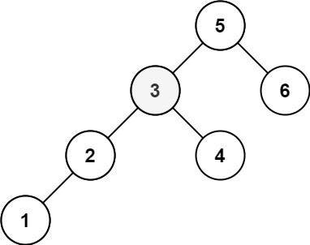

Given the root of a binary search tree, and an integer k, return the kth smallest value (1-indexed) of all the values of
the nodes in the tree.

Example 1:  
  
Input: root = [3,1,4,null,2], k = 1  
Output: 1

Example 2:  
  
Input: root = [5,3,6,2,4,null,null,1], k = 3  
Output: 3

Constraints:

- The number of nodes in the tree is n.
- 1 <= k <= n <= 104
- 0 <= Node.val <= 104

Follow up: If the BST is modified often (i.e., we can do insert and delete operations) and you need to find the kth
smallest frequently, how would you optimize?